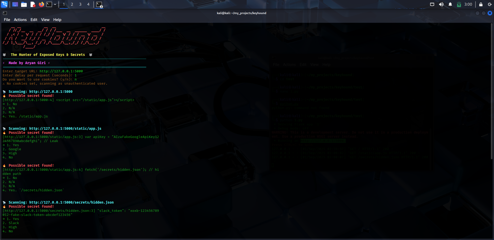
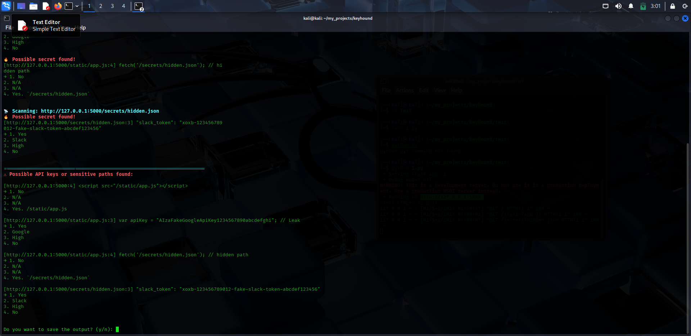

# 🐺 KeyHound – Hunter of Exposed Keys & Secrets  

<p align="center">
  
  
  
</p>

---

## ⚡ Overview
**KeyHound 🐺** is a smart **web secret scanner** that hunts for exposed API keys, tokens, secrets, and sensitive paths across multiple file types.  

It combines:
- 🎯 **Crawling** → finds referenced files & directories.  
- 🤖 **AI-Powered Analysis (Gemini)** → detects secrets even if regex fails.  
- 🎨 **Cool UI** → banners, colors, and Aryan’s hacker touch.  
- 🐺 **Customizable** → cookies, delay, and output saving.  

---

## 🚀 Features
- 🕵️ Scans common sensitive file types:
  - `.js, .ts, .php, .py, .rb, .java, .cs, .go, .swift, .env, .json, .yaml, .git-credentials`
- 🔗 Resolves and follows paths found inside files (`../../config.js`, `assets/api/user.js`).
- 🤖 Uses **Google Gemini AI** to detect **API keys / secrets** (no static regex required).
- ⏱ Adjustable request delay (avoid triggering WAF / rate limits).
- 🍪 Optional cookie-based scanning (authenticated sessions).
- 📂 Save findings into custom reports.
- 🎨 Hacker-style banner + colored output.
- ✨ Signature → **⚡ Made by Aryan Giri ⚡**

---
## Screenshots
 
 
---

## 📦 Installation

```bash
git clone https://github.com/giriaryan694-a11y/KeyHound.git
cd keyhound
pip install -r requirements.txt
```

## Requirements:
Python 3.8+
requests
google-generativeai
pyfiglet
termcolor
colorama

** Install them manually if needed: **
```bash
pip install requests google-generativeai pyfiglet termcolor colorama
```

## 🔑 API Key Setup 
1.Get a Google Gemini API Key → https://aistudio.google.com/
2.Create a file named key.txt in the project folder.
3.Paste your Gemini key inside:
```
your-gemini-api-key-here
```
## ⚡ Usage
```
python keyhound.py
```
** It will ask: **
Target URL → e.g., http://127.0.0.1:5000/
Delay per request (seconds) → e.g., 2
Cookies? → Enter if required (key=value; key2=value2)
Save output? → Yes/No

## ✨ Credits
⚡ Made by Aryan Giri
🐺 Inspired by the art of hunting secrets
